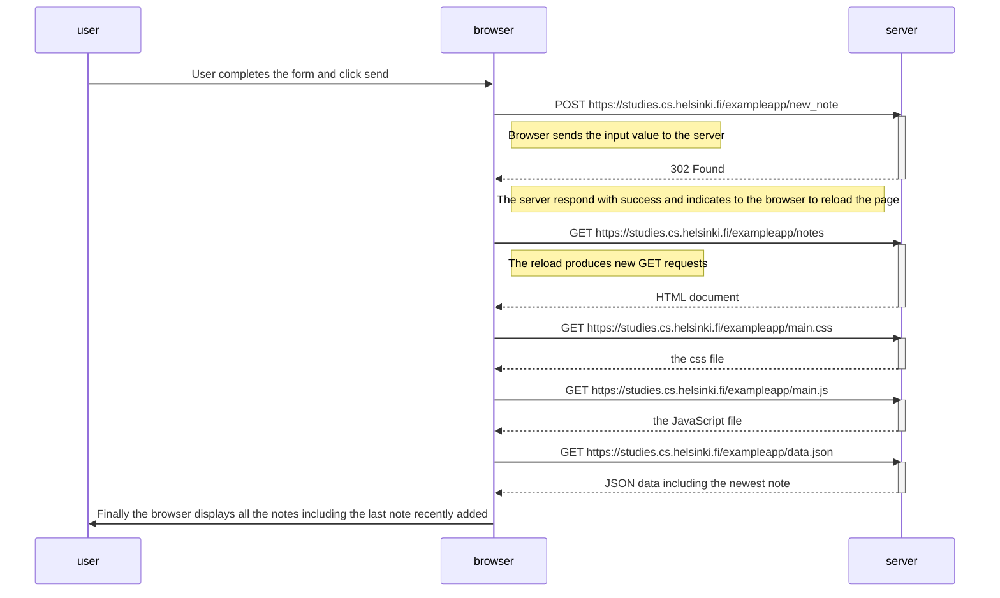

```mermaid

sequenceDiagram
    participant user
    participant browser
    participant server

    user->>browser: User completes the form and click send 

    browser->>server: POST https://studies.cs.helsinki.fi/exampleapp/new_note
    activate server
    Note right of browser: Browser sends the input value to the server

    server-->>browser: 302 Found
    deactivate server
    Note left of server: The server respond with success and indicates to the browser to reload the page

    
    browser->>server: GET https://studies.cs.helsinki.fi/exampleapp/notes
    activate server
    Note right of browser: The reload produces new GET requests

    server-->>browser: HTML document
    deactivate server
    
    browser->>server: GET https://studies.cs.helsinki.fi/exampleapp/main.css
    activate server
    server-->>browser: the css file
    deactivate server
    
    browser->>server: GET https://studies.cs.helsinki.fi/exampleapp/main.js
    activate server
    server-->>browser: the JavaScript file
    deactivate server
    

    browser->>server: GET https://studies.cs.helsinki.fi/exampleapp/data.json
    activate server
    server-->>browser: JSON data including the newest note 
    deactivate server    

     browser->>user: Finally the browser displays all the notes including the last note recently added
    
```