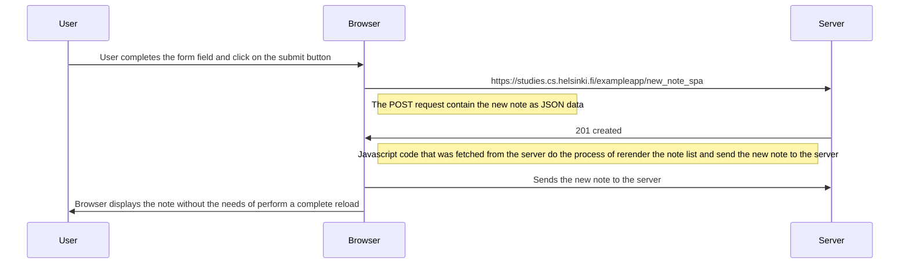

```mermaid

sequenceDiagram
    participant User
    participant Browser
    participant Server

    User->>Browser: User completes the form field and click on the submit button
    Browser->>Server: https://studies.cs.helsinki.fi/exampleapp/new_note_spa
    Note right of Browser: The POST request contain the new note as JSON data
    Server->>Browser: 201 created
    Note right of Browser: Javascript code that was fetched from the server do the process of rerender the note list and send the new note to the server 
    Browser->>Server: Sends the new note to the server
    Browser->>User: Browser displays the note without the needs of perform a complete reload
```